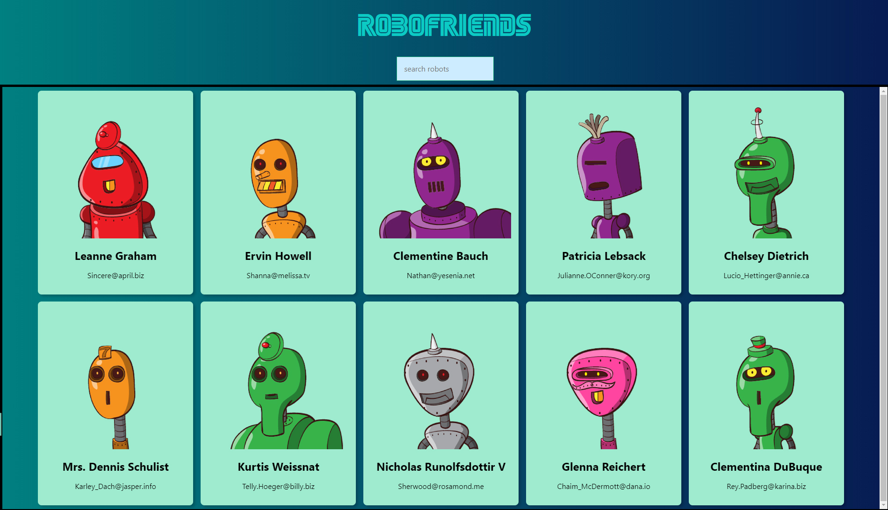

# Robofriends

A responsive page application created with the [React.js](https://github.com/facebook/react) library and the [Create-React-App](https://github.com/facebook/create-react-app) package.  

  

Make sure you have Node.js and npm installed. 
React to run the project:
1. Clone this repo
2. Run npm install
3. Run npm start
